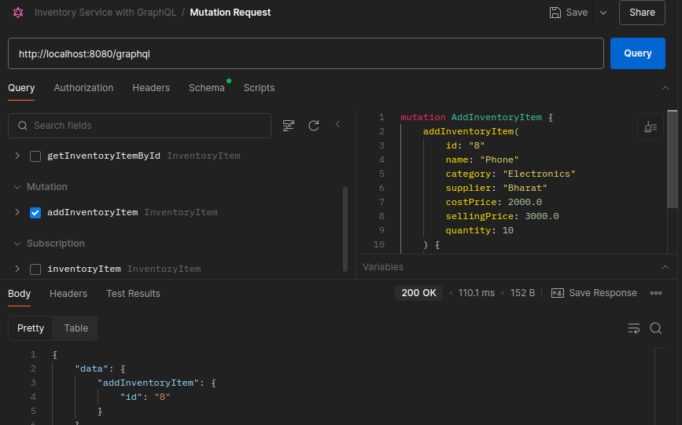
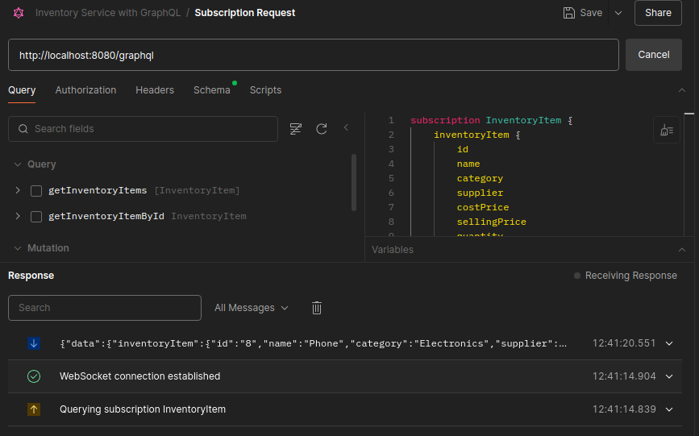

# GraphQL Demo Project

## Overview
This project is a demo application built with **Spring Boot**, **GraphQL**, and **Java**. It showcases the integration of GraphQL APIs with a backend service for managing inventory items.

## Features
- **GraphQL API**:
  - Queries to fetch inventory items.
  - Mutations to add new inventory items.
  - Subscriptions for real-time updates on inventory items.
- **REST API** (optional):
  - Endpoints for CRUD operations on inventory items.
- **Reactive Programming**:
  - Utilizes Reactor for handling subscriptions and real-time updates.

## Technologies Used
- **Java 17**
- **Spring Boot 3.4.5**
- **GraphQL**
- **Reactor**
- **Maven**

## Project Structure
- `src/main/java`: Contains the main application code.
  - `controller`: Handles GraphQL queries, mutations, and subscriptions.
  - `entities`: Defines the `InventoryItem` entity.
  - `service`: Contains business logic for inventory management.
  - `util`: Includes utility classes like `InventoryPublisher`.
- `src/main/resources/graphql`: Contains GraphQL schema files.
- `src/test/java`: Includes unit tests for the application.

## Setup Instructions
1. **Prerequisites**:
   - Java 17 or higher.
   - Maven installed.
2. **Clone the Repository**:
   ```bash
   git clone https://github.com/ibrahimnadra/GraphQLDemo.git
   cd GraphQLDemo
   ```
3. **Build the Project**:
   ```bash
   ./mvnw clean install
   ```
4. **Run the Application**:
   ```bash
   ./mvnw spring-boot:run
   ```
5. **Access GraphQL Playground**:
    - Navigate to `http://localhost:8080/graphql`.

## GraphQL Schema
The GraphQL schema defines the following types:
- **InventoryItem**: Represents an inventory item with fields like `id`, `name`, `category`, `supplier`, `costPrice`, `sellingPrice`, and `quantity`.
- **Query**: Fetch inventory items or a specific item by ID.
- **Mutation**: Add new inventory items.
- **Subscription**: Listen for real-time updates on inventory items.

## Testing
- Unit tests are written using **JUnit** and **Reactor Test**.
- Run tests with:
  ```bash
  ./mvnw test
  ```

## Testing with a Third-Party Client Using Postman:

1. Open Postman and click on create from my workspace section.
2. Select the GraphQL option.
3. Enter the GraphQL endpoint URL: `http://localhost:8080/graphql`.
4. Under the `Schema` tab, you can import the GraphQL schema file located at `src/main/resources/graphql/inventory.graphqls` in the project directory to get auto-completion and documentation support.
5. Under the `Query` tab, you can see all the method which are imported from the schema, under the related operation (query, mutation, subscription).
6. Check the schema method you want to test, for example, `addInventoryItem` and fill in the required argument fields.
7. Check the fields you want to return in the response.
8. Finally click on the `Query` button to execute the request and view the response.
9. For subscription, create new request and see the real time updates on adding new inventory items.

***Mutation Request***


***Subscription Request***

---